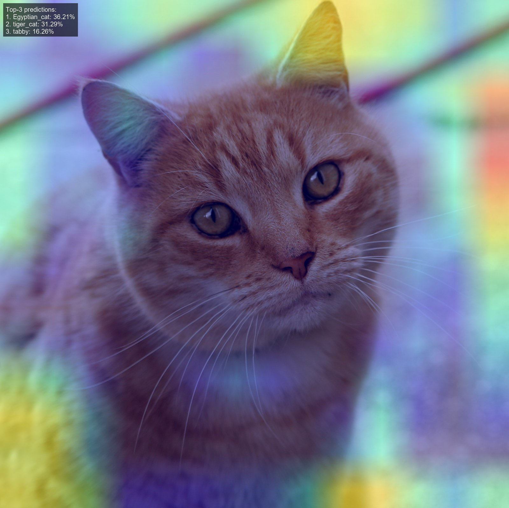
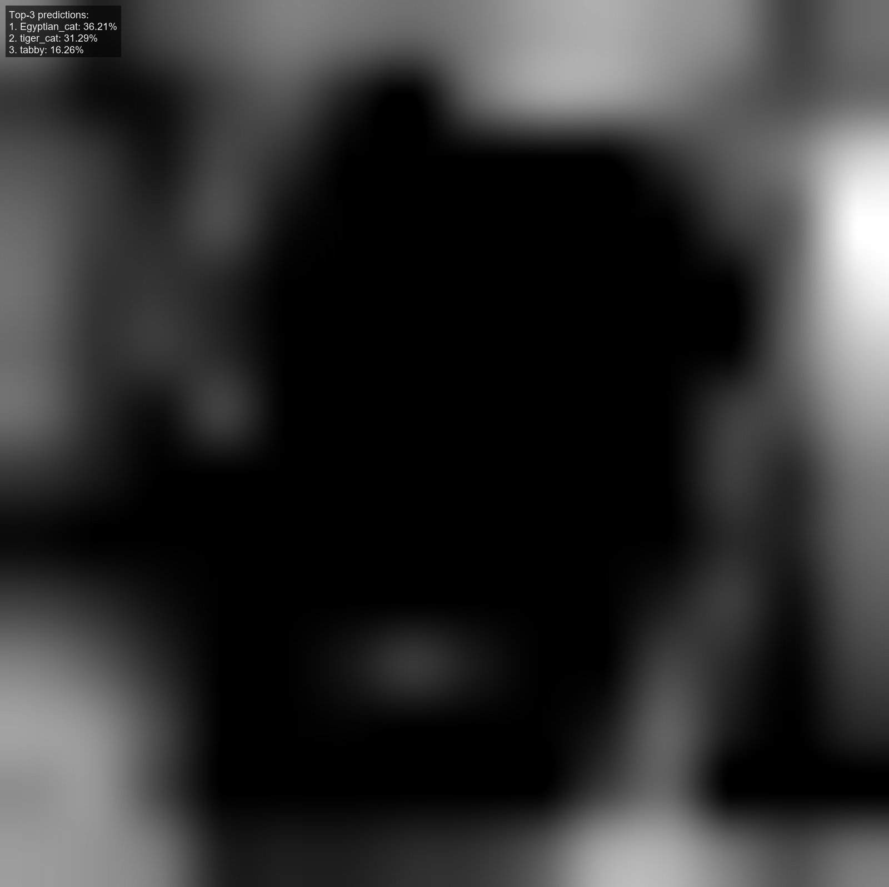

# image-classification-gradcam

VGG16 image classification with Grad-CAM explainability and quantitative heatmap analysis.

Pretrained VGG16 (ImageNet weights) classifies an input image and produces a class-discriminative saliency map via Gradient-weighted Class Activation Mapping (Grad-CAM). Heatmap quality is quantified using Shannon entropy, focus scores, and the Gini coefficient.

## Model

| Component | Detail |
|---|---|
| Architecture | VGG16 |
| Weights | ImageNet (pretrained) |
| Input size | 224 × 224 RGB |
| Grad-CAM layer | `block5_conv3` |
| Colormap | jet (overlaid at α = 0.4) |

## Key Results

**Top-3 predictions — `cat.jpg`**

| Rank | Label | ImageNet ID | Probability |
|---|---|---|---|
| 1 | Egyptian_cat | n02124075 | 36.21% |
| 2 | tiger_cat | n02123159 | 31.29% |
| 3 | tabby | n02123045 | 16.26% |

All three predictions are cat subtypes, confirming the model attends to the correct subject.

**Heatmap metrics**

| Metric | Value | Interpretation |
|---|---|---|
| Shannon entropy (bits) | 6.577 / 7.61 max | ~86% normalized — moderately diffuse |
| Top-10% focus | 0.34 | ~34% of activation mass in top 10% of pixels |
| Gini coefficient | 0.62 | Moderately unequal — some regions dominate |

The diffuse entropy is expected for an intermediate convolutional layer (block5_conv3). The Gini score confirms meaningful concentration on the cat's head, ears, and body rather than uniform background activation.

## Figures

| Grad-CAM Overlay | Raw Heatmap |
|---|---|
|  |  |

## Project Structure

```
image-classification-gradcam/
├── run.py                        ← entry point
├── cat.jpg                       ← test image
├── src/
│   ├── __init__.py               ← public API
│   ├── model.py                  ← load_model, load_and_preprocess, predict_top3
│   ├── gradcam.py                ← grad_cam
│   ├── viz.py                    ← save_overlay, save_heatmap
│   └── metrics.py                ← gini_coefficient, compute_heatmap_metrics
├── figures/
│   ├── cat_gradcam_overlay.png
│   └── cat_heatmap.png
├── docs/
│   └── project2_report.pdf
└── README.md
```

## Usage

```bash
pip install tensorflow pillow matplotlib numpy
python run.py
```

Requires `cat.jpg` in the repo root. Saves output figures to `figures/` and prints predictions and heatmap metrics to stdout.

## Note on AI Assistance

This project was completed as coursework for CSCI 8110. The VGG16 classification pipeline, Grad-CAM implementation, and heatmap metric design are my own work. GitHub Copilot assisted with image annotation formatting (Section 5). ChatGPT was used for help with metric interpretation and writing clarity. The code in this repository has been refactored with the assistance of Claude (Anthropic) for structure and readability.

## Paper
Full write-up including model setup, Grad-CAM methodology, and heatmap metric analysis:
[`docs/project2_report.pdf`](docs/Project2_CSCI8110_Image_Classification)

## References

1. CSCI 8110 Lecture Notes, Image Classification and Explainable AI, Fall 2025.
2. R. R. Selvaraju et al., "Grad-CAM: Visual Explanations from Deep Networks via Gradient-Based Localization," ICCV, 2017.
3. K. Simonyan and A. Zisserman, "Very Deep Convolutional Networks for Large-Scale Image Recognition," ICLR, 2015.
4. "Keras Applications – VGG16," Keras.io. https://keras.io/api/applications/vgg/#vgg16-function
5. "tf.GradientTape," TensorFlow.org. https://www.tensorflow.org/api_docs/python/tf/GradientTape
6. "What Is the Gini Coefficient," Our World in Data. https://ourworldindata.org/what-is-the-gini-coefficient
7. GitHub Copilot, GitHub, 2025.
8. OpenAI, ChatGPT, 2025.
